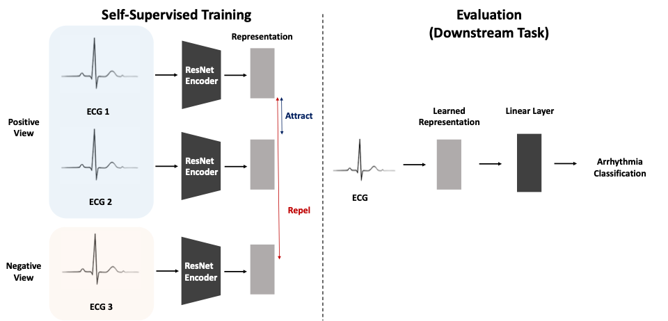

# Finding "Good Views" of Electrocardiogram Signals for Inferring Abnormalities in Cardiac Condition

## Paper
This repo contains a code implementation of the [final project document](assets/Finding%20_Good%20Views_%20of%20Electrocardiogram%20Signals%20for%20Inferring%20Abnormalities%20in%20Cardiac%20Condition.pdf) of [6.867 Machine Learning](http://www.ai.mit.edu/courses/6.867-f04/) at MIT. 

If you use our code or refer to our result in your research, please cite:
```
@inproceedings{jeonggoodview2021,
  author = {Jeong, Hyewon and Yun,Suyeol and Adam, Hammaad},
  title = {Finding "Good Views" of Electrocardiogram Signals for Inferring Abnormalities in Cardiac Condition},
  booktitle = {Preprint},
  year = {2021}
}
```

## Concept Figure


## Environment Setting
Our code dependencies on `python` and `pytorch`
```
python == 3.9.7
pytorch == 1.10.0
```

Or, simply run
```
pip install -r requirements.txt
```

## Dataset
Chapman electrocardiogram dataset is available at [here](https://figshare.com/collections/ChapmanECG/4560497/2).

1. Download `ECGDataDenoised.zip` and unzip it. Place the unzipped `ECGDataDenoised` inside the `dir_csv` defined in `path_configs.yaml`.

2. Download `Diagnostics.xlsx` and place it inside the `dir_csv` defined in `path_configs.yaml`. To remove NaN signals and use the same setting we used, [this file](https://docs.google.com/spreadsheets/d/1rW9f6FYswwbSRcf8A5YPSubb5cIYKxRs/edit?usp=sharing&ouid=109860069282059750704&rtpof=true&sd=true) instead.


## Training and Evaluation

### Supervised Baseline

To train and evaluate the strategies in the paper, run this command:
```
CUDA_VISIBLE_DEVICES=0 python sup_train.py --epochs 100 --name base --embed-size 4 --viewtype sup --model cnn
```
For evaluation on test set:
```
CUDA_VISIBLE_DEVICES=0 python sup_test.py --name base --viewtype sup --load-step 50 --embed-size 4
```

### Strategy 1 ([CLOCS](https://arxiv.org/pdf/2005.13249.pdf))
```
CUDA_VISIBLE_DEVICES=0 python train.py --epochs 100 --name clocstime --viewtype clocstime
CUDA_VISIBLE_DEVICES=0 python train.py --epochs 100 --name clocslead --viewtype clocslead
```

### Strategy 2 ([SimCLR](https://arxiv.org/pdf/2002.05709.pdf))

- We prepared pre-augmented ECG signals. These pre-augmented version of ECG signal is  downlodable at [here](https://www.dropbox.com/s/k7s1xeibp2yg8xu/preaug.pickle?dl=0) in python `pickle`. Download `preaug.pickle` and place it inside the `dir_csv` path defined in `path_configs.yaml`.

```
CUDA_VISIBLE_DEVICES=0 python train.py --epochs 7 --name simclr --viewtype simclr --batch-size 16 --epochs 7
```

- If you want to run without using pre-augmented ECG signals, you can run with `--no-preaug` argument as following command. This will start from the beginning that creates pre-augmented ECG signals.

```
CUDA_VISIBLE_DEVICES=0 python train.py --epochs 7 --name simclr --viewtype simclr --batch-size 16 --epochs 7 --no-preaug
```


### Strategy 3 (Matching on Demographics)
```
CUDA_VISIBLE_DEVICES=0 python train.py --epochs 100 --name demo --viewtype demos
```

### Strategy 4 (Matching on Cardiac Rhythms)
```
CUDA_VISIBLE_DEVICES=0 python train.py --epochs 100 --name rhythm --viewtype rhythm
```

### Strategy 5 (Matching on Wave Attributes)
```
CUDA_VISIBLE_DEVICES=0 python train.py --epochs 100 --name attr --viewtype attr
```

* One can also refer to inside the `runs` folder for running commands prepared in shell script.
